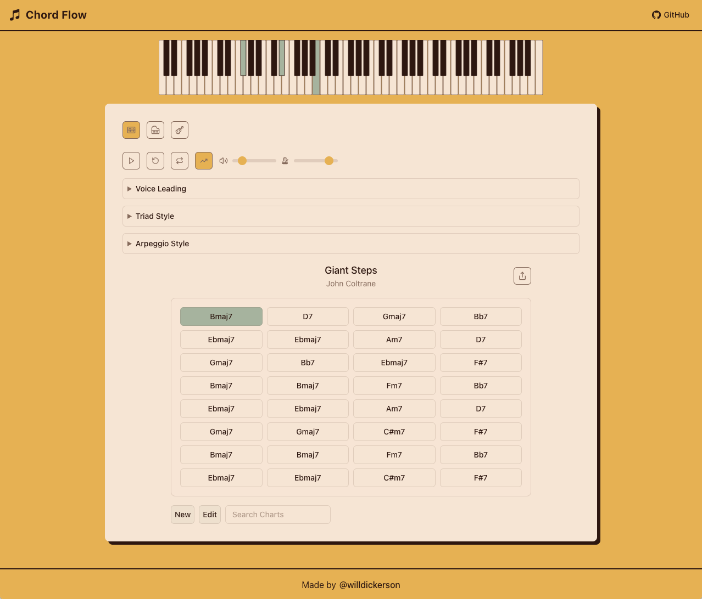

# Chord Flow 🎵

A web app for exploring and playing chord progressions with optimized voice leading.



**Try it here:** [Chord Flow](https://willdickerson.github.io/chord-flow/) to try the app.

## Development

```bash
# Install dependencies
npm install

# Start development server
npm run dev

# Build for production
npm run build
```

## Features

- Play chord progressions with optimized voice leading
- Choose between spread and close voicings
- Select which voices to optimize (bass, middle, high)
- Built with React, TypeScript, and Vite

## License

This project is open-source under the [MIT License](LICENSE).
